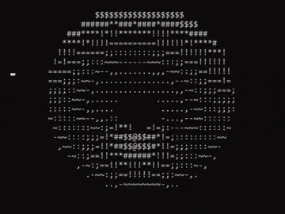

# 💫 About Me:

👋 Hi, I'm Roshan  🎓 Aspiring Software Engineer  💻 Passionate about building scalable applications and learning modern technologies.  🚀 Interested in Cloud Computing, Big Data, AI, and System Design.  🌱 Currently exploring new tools, frameworks, and best practices in software engineering.  🤝 Open to collaboration, internships, and entry-level opportunities.  📫 Reach me: roshan.kc7331@gmail.com 

## 🌐 Socials:
   

# 💻 Tech Stack:
                                                  

### 🎮 Pac-Man Contribution Graph

  <picture>
    <source media="(prefers-color-scheme: dark)" srcset="https://raw.githubusercontent.com/RO-03/RO-03/pacman-output/pacman-contribution-graph-dark.svg">
    <source media="(prefers-color-scheme: light)" srcset="https://raw.githubusercontent.com/RO-03/RO-03/pacman-output/pacman-contribution-graph.svg">
    
  </picture>

# 📊 GitHub Stats:

  
  

 

### 🏆 GitHub Trophies

  

<!-- Proudly created with GPRM ( https://gprm.itsvg.in ) -->
